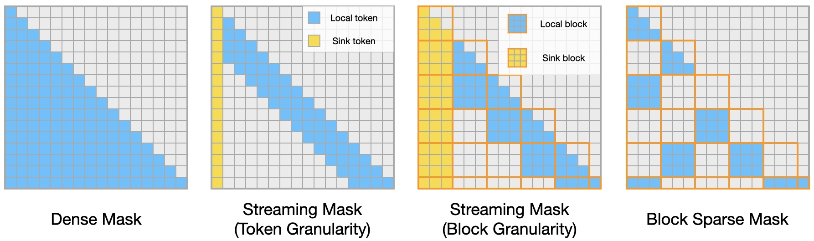
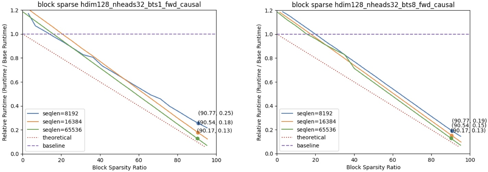
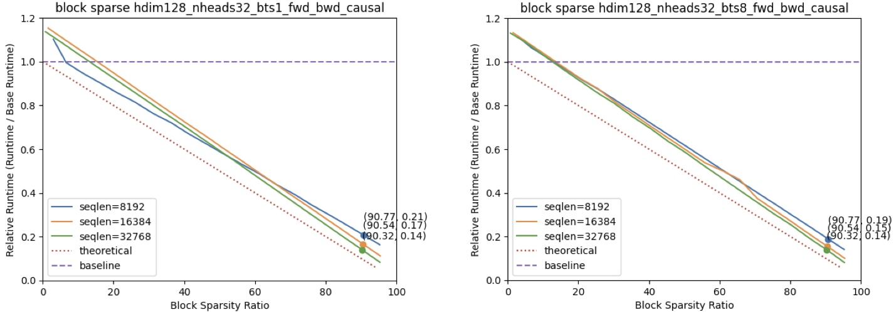
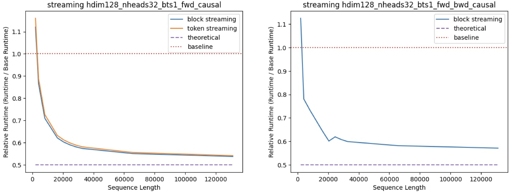

# Block Sparse Attention

As prompt lengths continue to increase, the computational and memory bandwidth demands of Large Language Models (LLMs) grow significantly, making efficient processing more challenging. However, by fully leveraging the inherent sparsity in attention patterns, we can optimize the model’s performance, effectively reducing inference costs in computation. This approach not only enhances the efficiency of LLMs but also enables them to handle longer and more complex prompts without a proportional increase in resource consumption. To this end, we introduce Block Sparse Attention, a library of sparse attention kernels that supports various sparse patterns, including streaming attention with token granularity, streaming attention with block granularity, and block-sparse attention. By incorporating these patterns, Block Sparse Attention can significantly reduce the computational costs of LLMs, thereby enhancing their efficiency and scalability.

We release the implementation of Block Sparse Attention, which is initially modified base on [FlashAttention](https://github.com/Dao-AILab/flash-attention) 2.4.2.



## News

- [2025/12] We updated the implementation:
  - Support running on Hopper (H100) and Blackwell (B200) GPUs.
  - Clean up Flash Attention supported features.
  - Optimize compilation speed, following Flash Attention 2.8.3.
  - Improve code quality for performance profiling tests.

- [2024/10] We release both fwd pass and bwd pass of Block Sparse Attention.

## Todos
- [2025/12] 
  - [ ] Update code implementation and CUTLASS version to align with FlashAttention 2.8.3.
  - [ ] Refactor internal kernel structure to reduce register pressure.
  - [ ] Optimize block mask storage mechanism to lower peak memory usage.

## Features

We have four patterns supported in Block Sparse Attention:

1. dense attention

   Calculate the full attention matrix.
2. streaming atteniton with token granularity

   Calculate the attention with a fixed number of sink tokens and local tokens. You can refer to [StreamingLLM](https://arxiv.org/abs/2309.17453) for more details.
3. streaming attention with block granularity, block_size = 128

   Calculate the attention with a fixed number of sink blocks and local blocks.
4. blocksparse attention, block_size = 128

   Take in a block mask and calculate the attention with the block mask.

**Importantly, we support assigning different patterns for different heads.**

You can use `head_mask_type` to specify the pattern for each head. This is a list of quiry head number of integers.

For one head, `mask_type = 0` means dense attention, `mask_type = -1` means streaming attention (either block streaming or exact streaming), and `mask_type = 1` means blocksparse attention, the head will use `basemask[mask_type - 1]` as its attention mask.

For example, if you have 8 heads and

```python
    head_mask_type = [1, 1, 0, 0, 0, -1, 0, -1]
```

This means head0, head1 use blocksparse mask, head2 to head4 and head 6 use dense mask, and head 5 and head 7 use streaming mask.

The interface is:

```python
from block_sparse_attn import block_sparse_attn_func
block_sparse_attn_func(
    q_unpad, k_unpad, v_unpad,
    cu_seqlens_q, cu_seqlens_k,
    head_mask_type,
    streaming_info,
    base_blockmask,
    max_seqlen_q_, max_seqlen_k_,
    p_dropout,
    deterministic=False,
    softmax_scale=None,
    is_causal=False,
    exact_streaming=False,
    return_attn_probs=False,
)
```

```python
from block_sparse_attn import block_streaming_attn_func
block_streaming_attn_func(
    q_unpad, k_unpad, v_unpad,
    cu_seqlens_q, cu_seqlens_k,
    head_mask_type,
    streaming_info,
    max_seqlen_q, max_seqlen_k,
    p_dropout,
    deterministic=False,
    softmax_scale=None,
    is_causal=True,
    return_attn_probs=False,
)
```

```python
from block_sparse_attn import token_streaming_attn_func
# bwd pass is not yet supported
token_streaming_attn_func(
    q_unpad, k_unpad, v_unpad,
    cu_seqlens_q, cu_seqlens_k,
    head_mask_type,
    streaming_info,
    max_seqlen_q, max_seqlen_k,
    deterministic=False,
    softmax_scale=None,
    return_attn_probs=False,
)
```

## Performance

### Block Sparse Speedup

<div align=center></div>

<div align=center></div>

The figures above illustrate the speedup gained by using Block Sparse Attention in comparison to dense FlashAttention2 2.4.2. This speedup was measured on an A100 GPU, with configurations including a head dimension of 128 and 32 attention heads.

### Dense & Streaming Hybrid Speedup

[Duo Attention](https://github.com/mit-han-lab/duo-attention) introduces a hybrid mask scenario, where half of the attention heads utilize a dense mask and the other half employ a streaming mask. This pattern is also proved to be an accurate approach for LLMs inference.

<div align=center></div>

The graph above demonstrates the performance of our kernel for this specified workload. For token-level streaming masks, we allocate 64 sink tokens and 256 local tokens. For block-level streaming masks, we allocate 1 sink block and 3 local blocks, with each block consisting of 128 tokens. Speedup results were measured on an A100 GPU, using dense FlashAttention2 as the baseline, with a head dimension of 128, 32 attention heads, and a batch size of 1.

## Installation

Requirements:

- CUDA 11.6 and above.
- PyTorch 1.12 and above.
- Linux.

```sh
pip install packaging
pip install ninja
python setup.py install
```

Block Sparse Interface: `block_sparse_attn/block_sparse_attn_interface.py`

Block Sparse Attention currently supports:

1. Datatype fp16 and bf16 (bf16 requires Ampere, Ada, or Hopper GPUs).
2. Head dimension 32, 64, 128.

### Tests

To run the correctness tests:
```sh
pip install pytest
```

- For fwd only

  ```sh
  cd ./block_sparse_tests/fwd/test_correctness
  pytest full_test.py
  ```
- For fwd and bwd

  ```sh
  cd ./block_sparse_tests/fwd_bwd/test_correctness
  pytest full_test.py
  ```

To run the performance tests:

- For fwd only

  ```sh
  cd ./block_sparse_tests/fwd/test_performance/
  python token_streaming.py
  python blocksparse.py
  ```
- For fwd and bwd

  ```sh
  cd ./block_sparse_tests/fwd_bwd/test_performance/
  python block_streaming.py
  python blocksparse.py
  ```

## Team

| | |
| --- | --- |
[Junxian Guo](https://github.com/JerryGJX): SJTU, MIT|  [Haotian Tang](http://kentang.net/): MIT
[Shang Yang](https://ys-2020.github.io/): MIT        |  [Zhekai Zhang](https://hanlab.mit.edu/team/zhekai-zhang): MIT
[Zhijian Liu](https://zhijianliu.com/): Nvidia, MIT  |  [Song Han](https://hanlab.mit.edu/songhan): Nvidia, MIT


## Acknowledgement

- [FlashAttention](https://github.com/Dao-AILab/flash-attention): the codebase we built upon. Thanks for their wonderful work. The design of block sparse attention in FlashAttention v1.0 is very inspiring.
- [FlashAttention](https://arxiv.org/abs/2205.14135), [FlashAttention-2](https://arxiv.org/abs/2307.08691), [Big Bird](https://arxiv.org/abs/2007.14062), [ETC](https://arxiv.org/abs/2004.08483): get the idea of block sparse attention and how it can be implemented.
- [StreamingLLM](https://arxiv.org/abs/2309.17453): get the idea of streaming attention.
- [Duo Attention](https://github.com/mit-han-lab/duo-attention), [MInference 1.0](https://arxiv.org/abs/2407.02490): get the idea of hybrid masks.

## Related Projects

- [DuoAttention](https://arxiv.org/abs/2410.10819): Efficient Long-Context LLM Inference with Retrieval and Streaming Heads
- [LServe](https://arxiv.org/abs/2502.14866): Efficient Long-sequence LLM Serving with Unified Sparse Attention
- [XAttention](https://arxiv.org/abs/2508.11131): Block sparse attention with antidiagonal scoring


## Citation

```
@misc{guo2024blocksparse,
  author       = {Guo, Junxian and Tang, Haotian and Yang, Shang and Zhang, Zhekai and Liu, Zhijian and Han, Song},
  title        = {{Block Sparse Attention}},
  year         = {2024},
  publisher    = {GitHub},
  journal      = {GitHub repository},
  howpublished = {\url{https://github.com/mit-han-lab/Block-Sparse-Attention}}
}

```